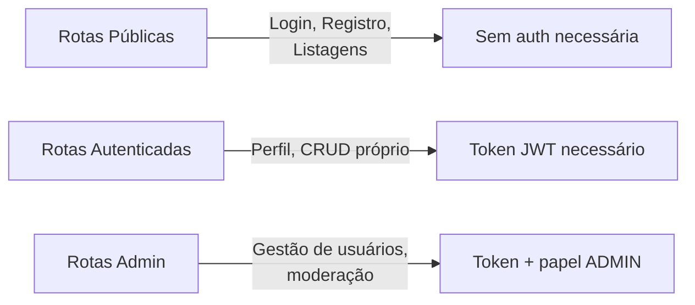
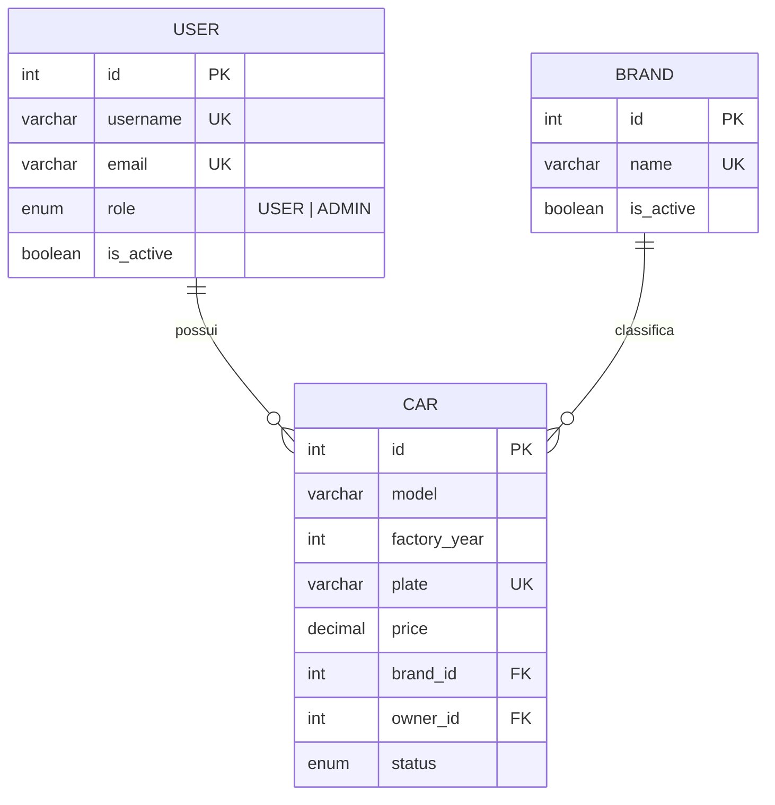

# Car API — Documentação Técnica

Bem-vindo à documentação oficial da **Car API**.

---

## Sobre o Projeto

A **Car API** é uma API REST backend desenvolvida com **FastAPI** para gerenciamento de usuários, marcas e anúncios de veículos. O projeto simula um cenário real de marketplace de veículos, com autenticação segura, controle de acesso por papéis e arquitetura modular.

**Estado atual:** Versão 0.1.0 — Funcional e estável.

---

## Características Principais

| Característica | Descrição |
|----------------|-----------|
| **API RESTful** | Endpoints organizados por recursos com métodos HTTP padrão |
| **Autenticação JWT** | Access token (30 min) + Refresh token (1 dia) |
| **RBAC** | Controle de acesso por papéis (USER / ADMIN) |
| **Ownership** | Validação de propriedade de recursos no backend |
| **Validações** | Regras de negócio com Pydantic v2 |
| **Async** | SQLAlchemy Async para operações de banco de dados |
| **Documentação** | Swagger UI + MkDocs com diagramas Mermaid |

---

## Separação de Acesso

A API possui três níveis de acesso claramente separados:



| Nível | Endpoints | Requisitos |
|-------|-----------|------------|
| **Público** | `/auth/login`, `/auth/refresh`, `/users/`, `/cars/`, `/brands/` | Nenhum |
| **Autenticado** | `/users/me`, `/cars/` (POST, PUT, DELETE) | Token JWT válido |
| **Administrativo** | `/admin/*` | Token JWT + papel ADMIN |

---

## Arquitetura do Sistema

```
┌─────────────────────────────────────────────────────────────┐
│                        Clientes                              │
│              (Web, Mobile, APIs de Terceiros)                │
└─────────────────────────────────────────────────────────────┘
                            │
                            ▼
┌─────────────────────────────────────────────────────────────┐
│                      Load Balancer                           │
│                   (Nginx / Proxy Reverso)                    │
└─────────────────────────────────────────────────────────────┘
                            │
                            ▼
┌─────────────────────────────────────────────────────────────┐
│                      Car API (FastAPI)                       │
│  ┌─────────────┬─────────────┬─────────────┬─────────────┐  │
│  │   Routers   │   Core      │   Models    │  Schemas    │  │
│  │  (Endpoints)│ (Security,  │ (SQLAlchemy)│  (Pydantic) │  │
│  │             │  Settings)  │             │             │  │
│  └─────────────┴─────────────┴─────────────┴─────────────┘  │
└─────────────────────────────────────────────────────────────┘
                            │
                            ▼
┌─────────────────────────────────────────────────────────────┐
│                    Banco de Dados                            │
│              (SQLite dev / PostgreSQL prod)                  │
└─────────────────────────────────────────────────────────────┘
```

---

## Stack Tecnológico

| Categoria | Tecnologia |
|-----------|------------|
| **Linguagem** | Python 3.13 |
| **Framework** | FastAPI |
| **ORM** | SQLAlchemy Async |
| **Validação** | Pydantic v2 |
| **Auth** | PyJWT + pwdlib (Argon2) |
| **Banco de Dados** | SQLite (dev) / PostgreSQL (prod) |
| **Migrações** | Alembic |
| **Gerenciador** | Poetry |
| **Qualidade** | Ruff (lint + format) |
| **Docs** | MkDocs + Material |

---

## Modelagem de Dados



**Entidades:**

- **User**: Usuários com papéis (USER/ADMIN) e controle de acesso
- **Brand**: Marcas de veículos (ex: Toyota, Volkswagen)
- **Car**: Anúncios de veículos com atributos detalhados

---

## Endpoints Principais

### Autenticação
```
POST   /api/v1/auth/login          # Obter tokens
POST   /api/v1/auth/refresh        # Renovar access token
```

### Usuários
```
POST   /api/v1/users/              # Registro
GET    /api/v1/users/me            # Perfil (auth)
PUT    /api/v1/users/me            # Atualizar perfil (auth)
DELETE /api/v1/users/me            # Excluir conta (auth)
```

### Carros
```
GET    /api/v1/cars/               # Listar (público, com filtros)
GET    /api/v1/cars/{id}           # Obter detalhes (público)
POST   /api/v1/cars/               # Criar (auth)
PUT    /api/v1/cars/{id}           # Atualizar (auth, owner)
DELETE /api/v1/cars/{id}           # Excluir (auth, owner)
```

### Admin
```
GET    /api/v1/admin/users/        # Listar usuários
PATCH  /api/v1/admin/users/{id}/role   # Alterar papel
POST   /api/v1/admin/cars/         # Criar carro (qualquer owner)
DELETE /api/v1/admin/cars/{id}     # Excluir carro (qualquer)
```

---

## Início Rápido

### 1. Clone e instale
```bash
git clone https://github.com/andreluoliveira82/car-api.git
cd car-api
poetry install
```

### 2. Configure variáveis de ambiente
```bash
# .env
DATABASE_URL=sqlite+aiosqlite:///./cars.db
JWT_SECRET_KEY=sua-chave-secreta-forte
MIN_FACTORY_YEAR=2000
MAX_FUTURE_YEAR=1
MAX_PRICE=10000000
MAX_MILEAGE=1000000
MAX_BRAND_DESCRIPTION=500
```

### 3. Execute migrações
```bash
alembic upgrade head
```

### 4. Inicie o servidor
```bash
poetry run task run
```

**Acesse:**
- API: http://127.0.0.1:8000
- Swagger: http://127.0.0.1:8000/docs
- Docs: http://127.0.0.1:8001 (com `poetry run task docs`)

---

## Estrutura da Documentação

| Documento | Conteúdo |
|-----------|----------|
| [Prerequisites](prerequisites.md) | Requisitos de ambiente e ferramentas |
| [Installation](installation.md) | Instalação passo a passo |
| [Configuration](configuration.md) | Variáveis de ambiente e settings |
| [Guidelines](guidelines.md) | Padrões de código e convenções |
| [Structure](structure.md) | Estrutura de diretórios |
| [API Endpoints](api-endpoints.md) | Catálogo completo de endpoints |
| [System Modeling](system-modeling.md) | Diagramas e modelagem |
| [Authentication](authentication.md) | JWT, RBAC e ownership |
| [Development](development.md) | Fluxo de desenvolvimento |
| [Testing](testing.md) | Estratégia de testes |
| [Deployment](deployment.md) | Deploy em produção |
| [Contributing](contributing.md) | Como contribuir |
| [Release Notes](release-notes.md) | Histórico de versões |

---

## Status do Projeto

| Componente | Status |
|------------|--------|
| Models e Banco de Dados | ✅ Completo |
| Autenticação JWT | ✅ Implementado |
| CRUD de Usuários | ✅ Completo |
| CRUD de Carros | ✅ Completo |
| CRUD de Marcas | ✅ Completo |
| Rotas Administrativas | ✅ Completo |
| Validações de Negócio | ✅ Implementado |
| Testes Automatizados | 🔄 Em desenvolvimento |
| Docker/Deploy | 📋 Planejado |

---

## Licença

MIT License — sinta-se livre para usar e modificar.

---

## Autor

**André Oliveira**  
Email: andreluoliveira@outlook.com  
GitHub: [andreluoliveira82](https://github.com/andreluoliveira82)

---

## Próximos Passos

Comece pela seção de [Instalação](installation.md) ou explore os [Endpoints da API](api-endpoints.md).
