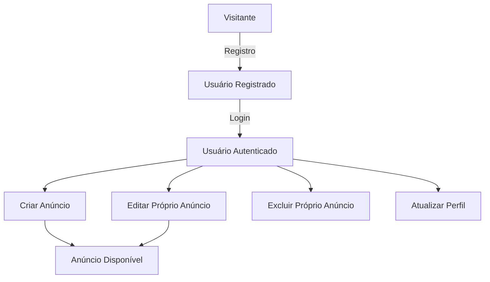
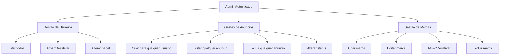
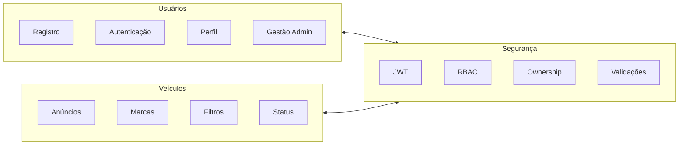
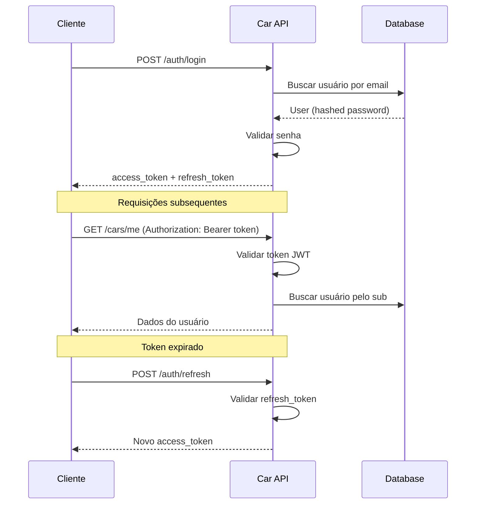
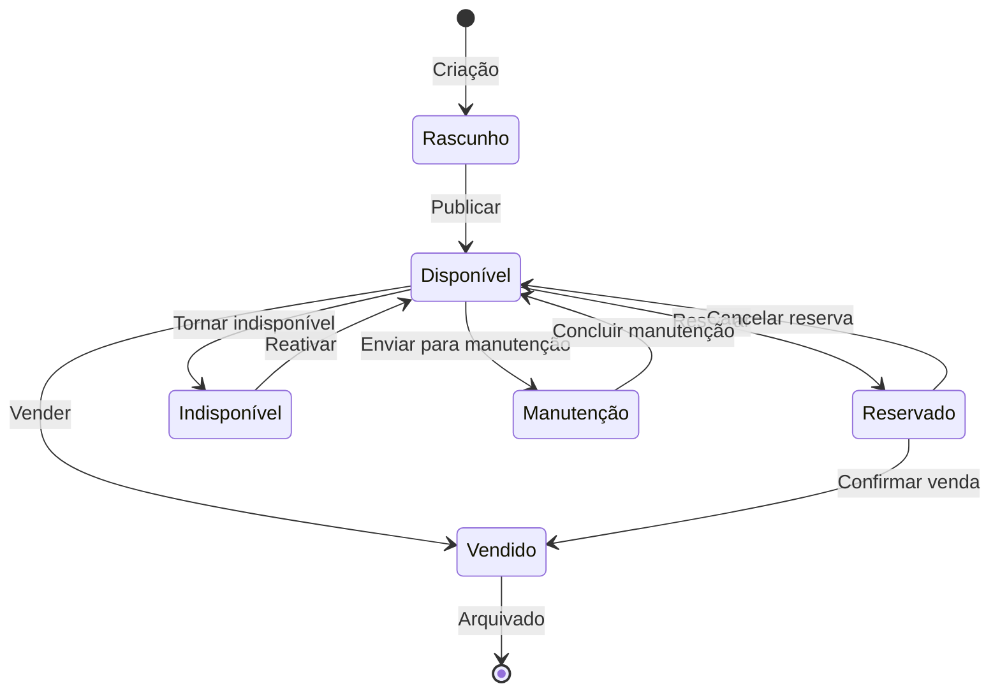

# Visão Geral do Projeto

A **Car API** é uma API REST backend para gerenciamento de anúncios de veículos, usuários e marcas. O projeto simula um marketplace de veículos com autenticação segura, controle de acesso por papéis e arquitetura modular profissional.

---

## Propósito

O projeto foi desenvolvido para:

1. **Gerenciar anúncios de veículos** — CRUD completo de carros com atributos detalhados (tipo, cor, combustível, transmissão, condição, status)
2. **Autenticar usuários** — Sistema JWT com access token e refresh token
3. **Controlar acesso por papéis** — Separação clara entre USER e ADMIN
4. **Validar ownership** — Usuários só gerenciam seus próprios recursos
5. **Servir como referência** — Boas práticas de arquitetura backend

---

## Casos de Uso

### Usuário Comum (USER)



**Permissões:**
- ✅ Registrar conta
- ✅ Autenticar e obter tokens
- ✅ Criar anúncios de carros (vinculados ao próprio usuário)
- ✅ Editar/excluir apenas seus próprios anúncios
- ✅ Atualizar perfil e senha
- ✅ Excluir própria conta
- ❌ Acessar rotas administrativas
- ❌ Gerenciar anúncios de terceiros

---

### Administrador (ADMIN)



**Permissões:**
- ✅ Todas as permissões de USER
- ✅ Listar todos os usuários do sistema
- ✅ Ativar/desativar contas de usuário
- ✅ Alterar papel de usuário (USER ↔ ADMIN)
- ✅ Criar anúncios em nome de qualquer usuário
- ✅ Editar/excluir qualquer anúncio
- ✅ Criar, editar e excluir marcas
- ✅ Moderar conteúdo do sistema

---

## Domínios do Sistema

A API é organizada em três domínios principais:



### Domínio: Usuários

| Entidade | Responsabilidade |
|----------|------------------|
| `User` | Dados de autenticação e perfil |
| `UserRole` | Papéis (USER / ADMIN) |
| Registro | Criação de conta pública |
| Perfil | Auto-gerenciamento (GET/PUT/DELETE /me) |
| Gestão Admin | Listagem, ativação, papéis |

### Domínio: Veículos

| Entidade | Responsabilidade |
|----------|------------------|
| `Car` | Anúncio de veículo com atributos |
| `Brand` | Marca do veículo |
| Enums | Tipo, cor, combustível, transmissão, condição, status |
| Filtros | Busca por múltiplos critérios |
| Status | Disponível, vendido, manutenção, reservado |

### Domínio: Segurança

| Componente | Responsabilidade |
|------------|------------------|
| JWT | Emissão e validação de tokens |
| RBAC | Controle de acesso por papel |
| Ownership | Validação de propriedade |
| Validações | Regras de negócio (senha, placa, anos) |

---

## Separação de Rotas

A arquitetura de rotas reflete os níveis de acesso:

| Categoria | Prefixo | Descrição | Exemplos |
|-----------|---------|-----------|----------|
| **Públicas** | `/api/v1/*` | Sem autenticação | Login, registro, listagens |
| **Autenticadas** | `/api/v1/*` | Token JWT necessário | Perfil, CRUD próprio |
| **Administrativas** | `/api/v1/admin/*` | Token + papel ADMIN | Gestão de usuários, moderação |

### Decisões de Design

**1. Owner ID não é informado pelo usuário comum**

Na criação de carros via rotas públicas/autenticadas, o `owner_id` é automaticamente definido como o ID do usuário autenticado. Isso previne que um usuário crie anúncios em nome de terceiros.

```python
# Router: cars.py (usuário comum)
db_car = Car(
    ...
    owner_id=current_user.id,  # Automático
)
```

**2. Admin pode criar para terceiros**

Apenas rotas administrativas aceitam `owner_id` explícito:

```python
# Router: admin/cars.py
db_car = Car(
    ...
    owner_id=car.owner_id,  # Informado no request
)
```

**3. Validação de ownership no backend**

A propriedade é validada antes de qualquer operação de escrita:

```python
verify_car_ownership(current_user, db_car.owner_id)
```

**4. Schemas administrativos separados**

Schemas de admin são distintos para evitar ambiguidade:

- `CarSchema` — Usuário comum (sem `owner_id`)
- `AdminCarCreateSchema` — Admin (com `owner_id`)

---

## Fluxo de Autenticação



---

## Ciclo de Vida de um Anúncio



**Status disponíveis:**

| Status | Descrição |
|--------|-----------|
| `available` | Visível nas listagens |
| `unavailable` | Temporariamente oculto |
| `sold` | Vendido (estado final) |
| `maintenance` | Em manutenção |
| `reserved` | Reservado por comprador |

---

## Regras de Negócio Principais

### Validações de Carro

| Campo | Regra |
|-------|-------|
| `model` | 2-50 caracteres, letras/números/espaços/hífens |
| `factory_year` | Mínimo 2000, máximo ano atual + 1 |
| `model_year` | >= factory_year, máximo ano atual + 1 |
| `plate` | Padrão antigo (AAA0000) ou Mercosul (AAA0A00) |
| `price` | 0 a 10.000.000 |
| `mileage` | 0 a 1.000.000 |
| `plate` | Único no sistema |

### Validações de Usuário

| Campo | Regra |
|-------|-------|
| `username` | 3-20 caracteres, começa com letra, letras/números/underscore |
| `password` | 6-15 caracteres, pelo menos 1 letra e 1 número |
| `email` | Formato válido, domínios descartáveis bloqueados |
| `full_name` | 3-50 caracteres, apenas letras e espaços |

### Validações de Marca

| Campo | Regra |
|-------|-------|
| `name` | 2-50 caracteres, único |
| `description` | Máximo 500 caracteres |
| Exclusão | Bloqueada se houver carros vinculados |

---

## Tecnologias e Ferramentas

| Categoria | Tecnologia | Versão |
|-----------|------------|--------|
| **Linguagem** | Python | 3.13 |
| **Framework Web** | FastAPI | 0.129.x |
| **ORM** | SQLAlchemy Async | 2.0.x |
| **Validação** | Pydantic | 2.x |
| **Auth** | PyJWT | 2.x |
| **Hash** | pwdlib (Argon2) | 0.3.x |
| **Banco de Dados** | SQLite / PostgreSQL | — |
| **Migrações** | Alembic | 1.x |
| **Gerenciador** | Poetry | 2.x |
| **Lint/Format** | Ruff | 0.15.x |
| **Docs** | MkDocs + Material | 9.x |

---

## Estrutura de Diretórios

```
car_api/
├── car_api/
│   ├── app.py              # Entry point
│   ├── core/               # Config, database, security
│   ├── models/             # SQLAlchemy models
│   ├── schemas/            # Pydantic schemas
│   ├── routers/            # Rotas públicas/autenticadas
│   │   └── admin/          # Rotas administrativas
│   └── validators/         # Validações de negócio
├── migrations/             # Alembic migrations
├── tests/                  # Testes automatizados
├── docs/                   # Documentação técnica
└── pyproject.toml          # Dependências e config
```

---

## Próximos Passos

| Seção | Conteúdo |
|-------|----------|
| [Prerequisites](prerequisites.md) | Requisitos de ambiente |
| [Installation](installation.md) | Instalação local |
| [Configuration](configuration.md) | Variáveis de ambiente |
| [API Endpoints](api-endpoints.md) | Catálogo de endpoints |
| [Authentication](authentication.md) | JWT e controle de acesso |
