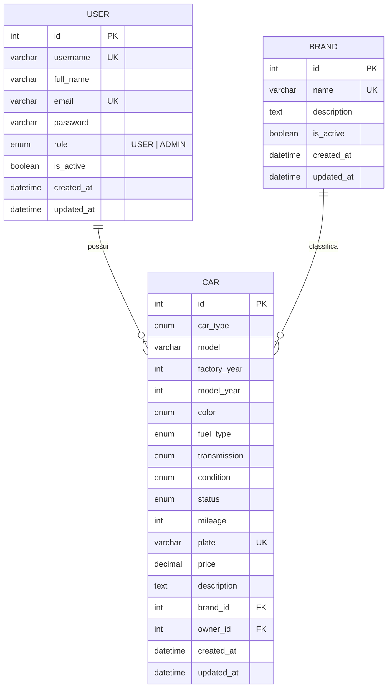
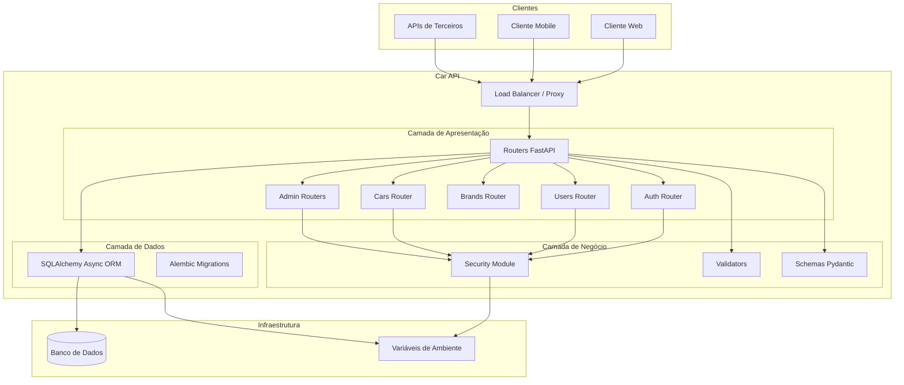
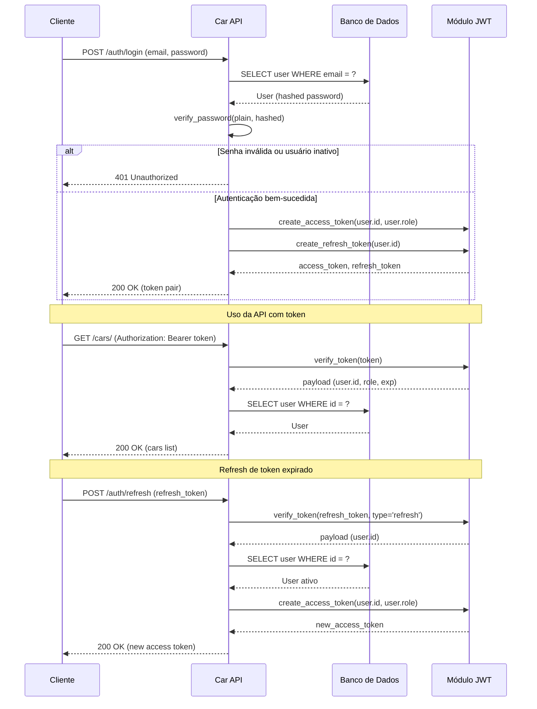
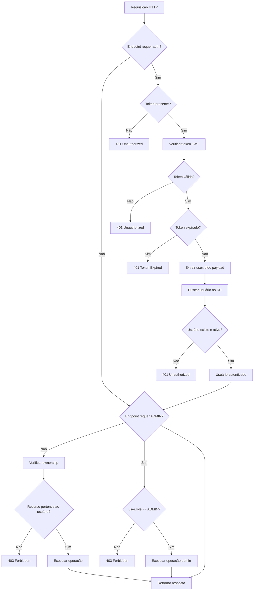
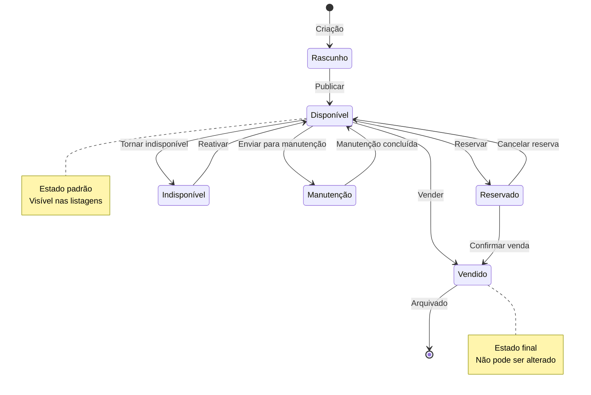
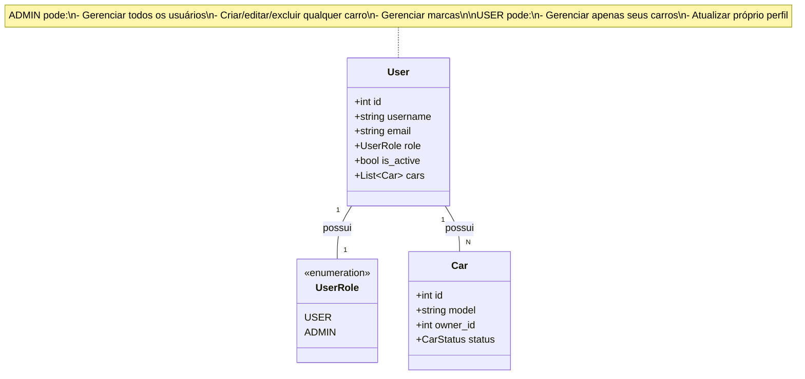

# Modelagem do Sistema

Este documento apresenta a modelagem do **Car API** através de diagramas Mermaid, incluindo estrutura de dados, arquitetura geral e fluxos principais.

---

## Diagrama de Entidades (ERD)



### Relacionamentos

| Relacionamento | Cardinalidade | Descrição |
|----------------|---------------|-----------|
| USER → CAR | 1:N | Um usuário pode possuir vários carros |
| BRAND → CAR | 1:N | Uma marca pode classificar vários carros |
| CAR → USER | N:1 | Cada carro pertence a um único usuário |
| CAR → BRAND | N:1 | Cada carro pertence a uma única marca |

### Integridade Referencial

- `CAR.brand_id` → `BRAND.id`: Cascade delete **desabilitado** (não excluir marca com carros)
- `CAR.owner_id` → `USER.id`: Cascade delete **habilitado** (carros são excluídos se usuário for removido)

---

## Arquitetura Geral do Sistema



### Camadas da Arquitetura

| Camada | Componentes | Responsabilidade |
|--------|-------------|------------------|
| Apresentação | Routers | Receber requisições HTTP, validar schemas, retornar respostas |
| Negócio | Security, Validators | Autenticação, autorização, regras de domínio |
| Dados | ORM, Models, Migrations | Persistência e recuperação de dados |

---

## Fluxo de Autenticação



### Componentes do Fluxo

| Etapa | Descrição |
|-------|-----------|
| Login | Valida credenciais e gera token pair |
| Acesso | Verifica token em cada requisição protegida |
| Refresh | Renova access token sem exigir nova autenticação |

---

## Fluxo CRUD de Carros

```mermaid
flowchart TD
    subgraph Criação
        C1[Cliente autenticado] --> C2[POST /cars/]
        C2 --> C3{Validar schema}
        C3 -->|Inválido| C4[400 Bad Request]
        C3 -->|Válido| C5{Marca existe?}
        C5 -->|Não| C4
        C5 -->|Sim| C6{Placa duplicada?}
        C6 -->|Sim| C4
        C6 -->|Não| C7[Salvar carro owner_id = user.id]
        C7 --> C8[201 Created]
    end

    subgraph Leitura
        L1[Cliente] --> L2{GET /cars/ ou /cars/{id}?}
        L2 -->|Lista| L3[GET /cars/?filters]
        L2 -->|Detalhe| L4[GET /cars/{id}]
        L3 --> L5[Aplicar filtros e paginação]
        L4 --> L6[Buscar carro + relações]
        L5 --> L7[200 OK cars list]
        L6 --> L8{Carro existe?}
        L8 -->|Não| L9[404 Not Found]
        L8 -->|Sim| L10[200 OK car detail]
    end

    subgraph Atualização
        U1[Cliente autenticado] --> U2[PUT /cars/{id}]
        U2 --> U3{Carro existe?}
        U3 -->|Não| U4[404 Not Found]
        U3 -->|Sim| U5{É proprietário?}
        U5 -->|Não| U6[403 Forbidden]
        U5 -->|Sim| U7{Placa alterada e duplicada?}
        U7 -->|Sim| U8[400 Bad Request]
        U7 -->|Não| U9[Aplicar atualizações]
        U9 --> U10[200 OK updated car]
    end

    subgraph Exclusão
        D1[Cliente autenticado] --> D2[DELETE /cars/{id}]
        D2 --> D3{Carro existe?}
        D3 -->|Não| D4[404 Not Found]
        D3 -->|Sim| D5{É proprietário?}
        D5 -->|Não| D6[403 Forbidden]
        D5 -->|Sim| D7[Excluir carro]
        D7 --> D8[204 No Content]
    end
```

### Regras de Negócio

| Operação | Regra |
|----------|-------|
| Criar | Marca deve existir, placa deve ser única, owner_id é o usuário autenticado |
| Listar | Público, com filtros e paginação |
| Obter | Público, inclui marca e proprietário |
| Atualizar | Apenas proprietário ou ADMIN |
| Excluir | Apenas proprietário ou ADMIN |

---

## Fluxo de Segurança e Controle de Acesso



### Níveis de Acesso

| Nível | Descrição | Endpoints |
|-------|-----------|-----------|
| Público | Sem autenticação | Login, registro, listagem de carros/marcas |
| Autenticado | Token JWT válido | Perfil do usuário, CRUD de carros próprios |
| Admin | Token + role ADMIN | Gestão de usuários, carros e marcas |

### Validações de Segurança

1. **Token JWT**: Assinado com chave secreta, validação de expiração e tipo
2. **Usuário ativo**: Verificação de `is_active = true`
3. **Ownership**: Validação de propriedade de recursos
4. **Role-based access**: Verificação de papel para rotas administrativas

---

## Ciclo de Vida de um Carro



### Estados do Carro

| Status | Descrição |
|--------|-----------|
| `available` | Carro disponível para venda |
| `unavailable` | Temporariamente indisponível |
| `sold` | Vendido (estado final) |
| `maintenance` | Em manutenção |
| `reserved` | Reservado por comprador |

---

## Hierarquia de Papéis (RBAC)



### Permissões por Papel

| Permissão | USER | ADMIN |
|-----------|------|-------|
| Listar carros públicos | ✅ | ✅ |
| Criar carros próprios | ✅ | ✅ |
| Editar carros próprios | ✅ | ✅ |
| Excluir carros próprios | ✅ | ✅ |
| Listar todos os usuários | ❌ | ✅ |
| Ativar/desativar usuários | ❌ | ✅ |
| Alterar papel de usuário | ❌ | ✅ |
| Criar carros para terceiros | ❌ | ✅ |
| Editar qualquer carro | ❌ | ✅ |
| Excluir qualquer carro | ❌ | ✅ |
| Gerenciar marcas | ❌ | ✅ |

---

## Próximo Passo

Consulte [Autenticação e Segurança](authentication.md) para detalhes sobre o funcionamento do JWT e controle de acesso.
